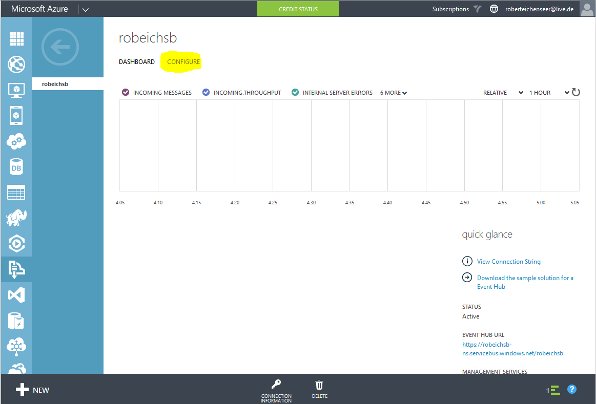
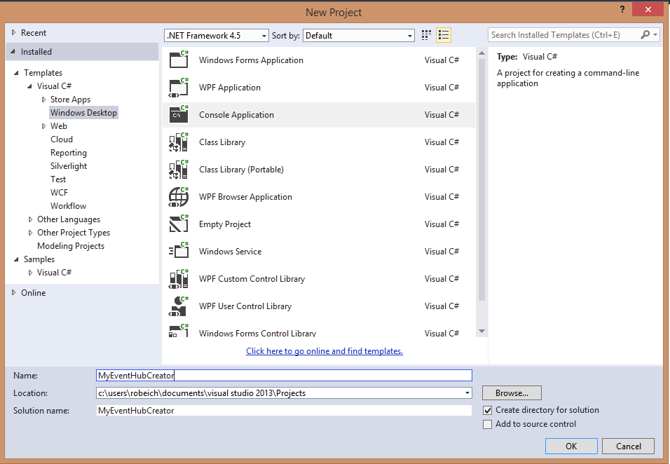
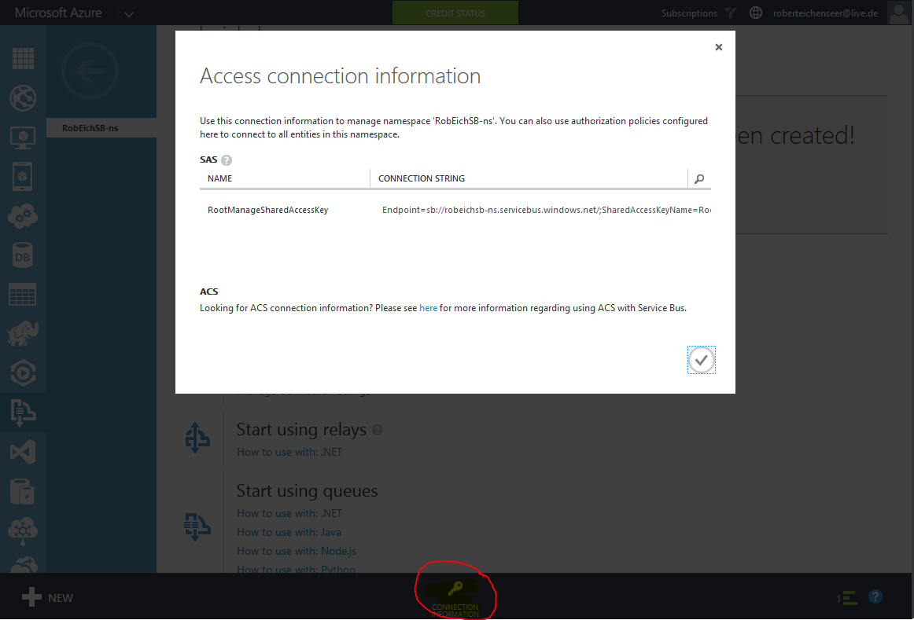

Using EventHubs for sending telemetry data at high scale
========================================================
Many modern solutions that intend to provide adaptive customer experiences or to improve products through continuous feedback and automated telemetry are faced with the challenge of how to securely and reliably ingest very large amounts of information from many concurrent publishers. Microsoft Azure Event Hubs is a managed platform service that provides a foundation for large-scale data ingestion in a broad variety of scenarios. Examples of such scenarios are behavior tracking in mobile apps, traffic information from web farms, in-game event capture in console games, or telemetry data collected from industrial machines or connected vehicles. The common role that Event Hubs plays in solution architectures is that it acts as the “front door” for an event pipeline, often called an event ingestor. An event ingestor is a component or service that sits between event producers and event consumers to decouple the production of an event stream from the consumption of those events.

You'll create a EventHub with the requiered configuration and security setting using the Microsoft Azure Portal or custom code using Visual Studio. Afterwards we will send telemetry from your Tessel microcontroller to the EventHub. 

Prerequisites
-------------
In order to successfully complete this lab you need to:

* Have successfully setup your Azure Subscription, your development environment and your Tessel according to instructions outlined in the [Setup Lab](../_setup).
* You can create and configure the EventHub by using the Azure portal. In this case you don't need any further prerequisites
* If you want to configure and create the EventHub by code an installation of Visual Studio with the Azure SDK is necessary. You can download a free version of Visual Studio from http://www.visualstudio.com/en-us/products/visual-studio-express-vs.aspx. The Azure SDK can be downloaded from http://azure.microsoft.com/en-us/downloads/

Instructions (using the Azure Portal to create an Event Hub)
------------------------------------------------------------

During this secition we will use the [Azure Portal](https://manage.windowsazure.com) for the creation and configuration of the EventHubs.
We will: 

* Create a new ServiceBus Namespace
* Create a new EventHub within the created ServiceBus Namespace
* Create the necessary credentials for accessing the EventHub

Later in the lab we will see how the same configuration can be done from a C# code within a console application running on-premise.

### Creating a new Azure ServiceBus namespace

* Start by logging in to the [Azure Portal](https://manage.windowsazure.com).
* Click "+ NEW", located in the lower left corner and select: App Services -> Service Bus -> Event Hub -> Quick Create

* Fill in a Event Hub Name of your choice (How about "YourInitials + EH")
* Select a region (because we are in Berlin we would recommend Europe North or Europe West but you are free to choose any other region)
* Fill in a Namespae Name or leave the automatically created name. This name will be part of the URI which uniquely identifies your Event Hub (How about "YourInitials + -ns")
* Click on "CREATE A NEW EVENT HUB"

After a while, you'll see "Active" in the status column of you new created EventHub

* Click on the name of your Event Hub in the column "Namespace Name"
* Familiarize yourself with the information you have in front of yourself. From here you have shortcuts to tutorials, tools etc.
* Click on "Event Hubs" at the top of the screen

* Click on the name of the created Event Hub in the column "NAME"

You see now a dashboard which gives you more information concerning the created Event Hub like the connection string, the Event Hub Url etc.

* Click on "CONFIGURE" at the top of the page

* You see information concerning the MESSAGE RETENTION (default is one day), the STATE of the Event Hub and the PARTITION COUNT
* In the lower part of the page you see a secition called "shared access policies". Within this section we create a new entry
* Just key in a new policy name (the name is up to you; How about "SendRights")

* Click "Save" at the bottom of the page
* Copy the "PRIMARY KEY" and store it for further usage

Congratulation! You have created and configured your first Event Hub using the Azure Portal

Instructions (Creating / Configuring Event Hub using C#)
--------------------------------------------------------

In this section we will create an Event Hub by using C# in an on-premise console application. Please be aware; this steps are not necessary if you have already created the Event Hub using the Azure Portal. We will reuse the already created Service Bus Namespace and will add a second Event Hub to the Namespace.

We will: 

* Create a new EventHub within the created ServiceBus Namespace
* Create the necessary credentials for accessing the EventHub

### Start Visual Studio

* Start Visual Studio on your computer (please ensure that you have the Azure SDK installed)
* Create a new Console application by clicking FILE -> NEW -> PROJECT and select "Console Application" from the screen
* Give the solution a meaningful name (How about: "MyEventHubCreator")

### Writing the code to create the Event Hub
* After the solution is created for you, open the "Package Manager Console". If it isn't shown, go to VIEW -> OTHER WINDOWS -> PACKAGE MANAGER CONSOLE
* Key in: Install-Package WindowsAzure.ServiceBus and confirm by pressing Enter

The necessary Nuget packages to interact with Service Bus and Event Hub will be downloaded and added to your solution.

Let's start coding and let us create the Event Hub by code

* Replace your auto generated Main function with the code from [api/Program.cs](api/Program.cs).
* Replace "Please Provide Your ServiceBus Namespace" with the name of your Service Bus Namespace.
* Replace "Please Provide Your ServiceBus Shared Access Key" with the Shared Access Key from your Service Bus Namespace. You can find the key in the Azure Portal by clicking "CONNECTION INFORMATION" on the bottom of your page. Please take care that you request the connection information for the Service Bus Namespace and not for the already created Event Hub. 

* The provided connection string looks similiar to:
	Endpoint=sb://robeichsb-ns.servicebus.windows.net/;SharedAccessKeyName=RootManageSharedAccessKey;SharedAccessKey=VaXjVOfZWDj47+bDtCzmbYfu2vt6+I=	
* Please copy the value of SharedAccessKey into your code
* Add the following two using statements to your code:

	using Microsoft.ServiceBus;
	using Microsoft.ServiceBus.Messaging;

* Build the application and step through the application

Contratulation! You have created your second Event Hub within a C# application.

### Connecting Tessel to the new created Event Hub

So now that we have a Event Hub ready for us to ingest data, let's call it from our Tessel. The sample code is located in the [tessel](tessel) folder. Familiarize yourself with the code and change the URL to point to your custom API, then:

	cd tessel
	tessel run blinky-websites.js

You will see some output on the console and when you are told to press the config-button (close to the orange led on your Tessel), do so and your Tessel will call your custom API hosted on Azure Websites. When the random number returns, the Tessel will flash its led as many times as the random number said.

### Monitor server side log using Azure-CLI (Azure x-plat tools)

Whenever we press the button on the Tessel a HTTP Request gets sent to the Azure Website hosting your "random service". Wouldn't it be nice if we could monitor whatever gets written to the serverside log, directly from our computer? It turns out it is quite easy.

Since we have already (in the [setup lab](../_setup)) connected our Azure subscription with the current user on this computer, we can user the command line tools for azure to do exactly that. Keep running the Tessel application and open a new terminal/console window and execute the following command in the new window. Replace [websitename] with the name of the website you created.

Summary
-------

More information
----------------

You have just created Node.js RESTful API, hosted it on Azure Websites and then deployed a Node.js program to your Tessel that calls out to the cloud and receives random numbers.

Now, go ahead and play around with the solution. Tweak it, extend it, use it in a bigger context. Good luck!
