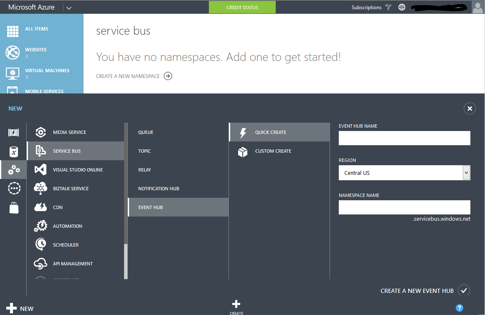

Using EventHubs for sending telemetry data at high scale
========================================================
Many modern solutions that intend to provide adaptive customer experiences or to improve products through continuous feedback and automated telemetry are faced with the challenge of how to securely and reliably ingest very large amounts of information from many concurrent publishers. Microsoft Azure Event Hubs is a managed platform service that provides a foundation for large-scale data ingestion in a broad variety of scenarios. Examples of such scenarios are behavior tracking in mobile apps, traffic information from web farms, in-game event capture in console games, or telemetry data collected from industrial machines or connected vehicles. The common role that Event Hubs plays in solution architectures is that it acts as the “front door” for an event pipeline, often called an event ingestor. An event ingestor is a component or service that sits between event producers and event consumers to decouple the production of an event stream from the consumption of those events.

You'll create a EventHub with the requiered configuration and security setting using the Microsoft Azure Portal or custom code using Visual Studio. Afterwards we will send telemetry from your Tessel microcontroller to the EventHub. 

Prerequisites
-------------
In order to successfully complete this lab you need to:

* Have successfully setup your Azure Subscription, your development environment and your Tessel according to instructions outlined in the [Setup Lab](../_setup).
* You can create and configure the EventHub by using the Azure portal. In this case you don't need any further prerequisites
* If you want to configure and create the EventHub by code an installation of Visual Studio with the Azure SDK is necessary. You can download a free version of Visual Studio from http://www.visualstudio.com/en-us/products/visual-studio-express-vs.aspx. The Azure SDK can be downloaded from http://azure.microsoft.com/en-us/downloads/

Instructions (Using the Azure Portal)
-------------------------------------

During this secition we will use the [Azure Portal](https://manage.windowsazure.com) for the creation and configuration of the EventHubs.
We will: 

* Create a new ServiceBus Namespace
* Create a new EventHub within the created ServiceBus Namespace
* Create the necessary credentials for accessing the EventHub

Later in the lab we will see how the same configuration can be done from a C# code within a console application running on-premise.

### Creating a new Azure ServiceBus namespace

* Start by logging in to the [Azure Portal](https://manage.windowsazure.com).
* Click "+ NEW", located in the lower left corner and select: App Services -> Service Bus -> Event Hub -> Quick Create

* Fill in a Event Hub Name of your choice (How about "YourName + _EH")
* Select a region (because we are in Berlin we would recommend Europe North or Europe West but you are free to choose any other region)
* Fill in a Namespae Name. This name will be part of the URI which uniquely identifies your Event Hub (How about "YourName + _SB")
* Click on "CREATE A NEW EVENT HUB"
